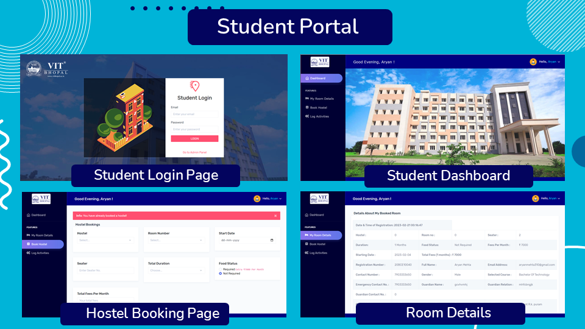
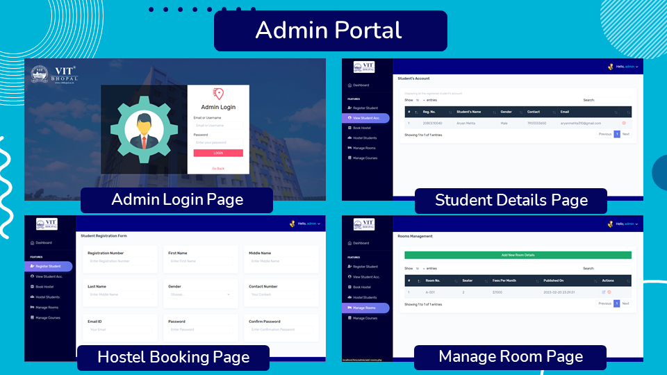

# RoomEase: Simplify Hostel Room Allocation

RoomEase is a user-friendly and efficient hostel room allocation system designed to streamline the process of assigning rooms to residents. With its intuitive interface and powerful features, RoomEase takes the hassle out of managing room assignments, making it a go-to solution for hostel administrators.

Say goodbye to manual paperwork and endless spreadsheets. RoomEase automates the entire room allocation process, saving you time and effort. Our intelligent algorithm considers various factors such as preferences, room availability, and roommate compatibility to optimize room assignments and ensure resident satisfaction.

RoomEase offers a centralized dashboard where administrators can easily view and manage room allocations. Quickly access resident profiles, room occupancy status, and any special requests or notes. With just a few clicks, allocate rooms, transfer residents, or make adjustments as needed.

Residents can also benefit from RoomEase by providing them with a seamless experience. With our resident portal, they can submit their preferences, view their assigned rooms, and connect with potential roommates. Enhance resident satisfaction by allowing them to communicate and form roommate groups within the system.

RoomEase goes beyond room allocation. It offers additional features such as automated check-in/check-out processes, maintenance requests, and communication tools. Keep residents informed about important announcements and upcoming events through in-app notifications.

Security and privacy are paramount. RoomEase ensures the confidentiality of resident information by employing advanced encryption and data protection measures.

Simplify your hostel room allocation process with RoomEase and experience enhanced efficiency, resident satisfaction, and streamlined administration. Let RoomEase handle the complexities while you focus on creating a harmonious living environment for your hostel residents.
 
\

